Steps to execute 

1. created the dockerfile for all 5 MS and build and push the same to dockerhub

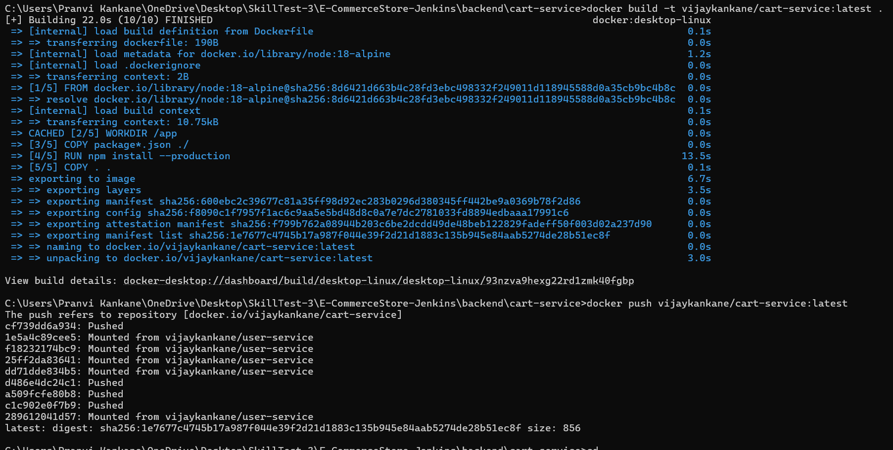 

 

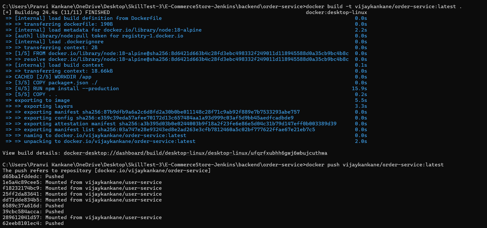 

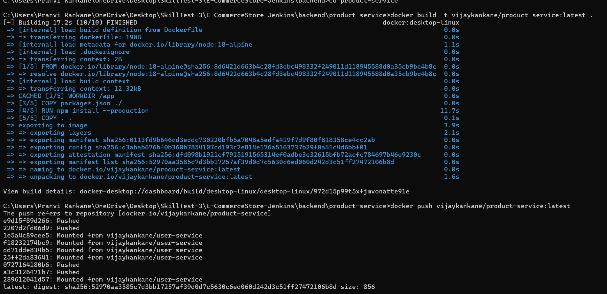 

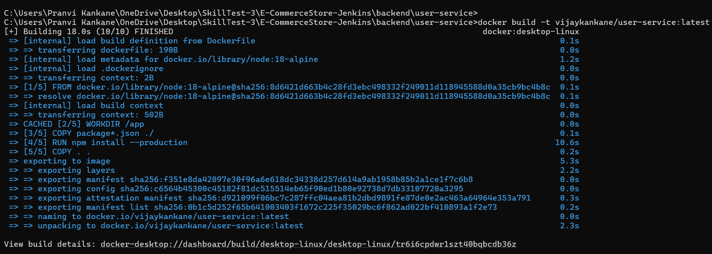

All images are in teh dockerhub now.

now provisioning the infra by terraform and deploy the docker images through terraaform .
1. create main.tf with VPC creation , EC2 ,Security group creation with the 80, 3000 ports in ingress and rest 3001-3004 to internal
2. create variable.tf for the input for the keyname/region/instancetype/dockername
3. running terraform init 
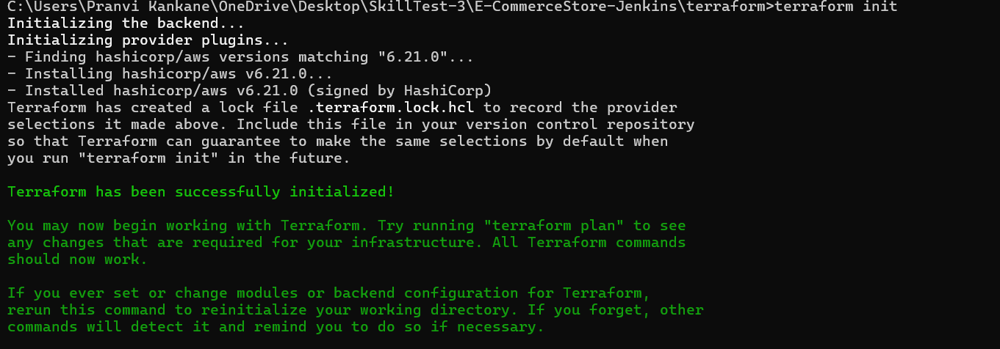

teeraform plan 

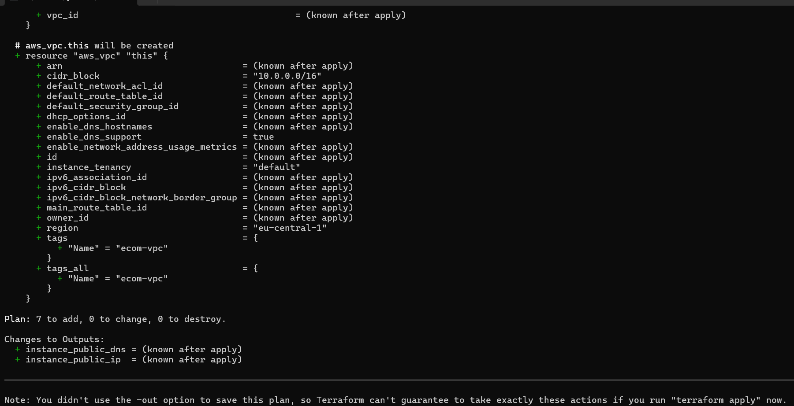

terraform apply and output of the EC2 provistioned

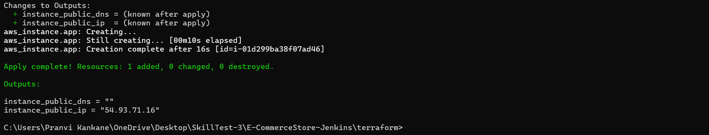

VPC creation with public subnet
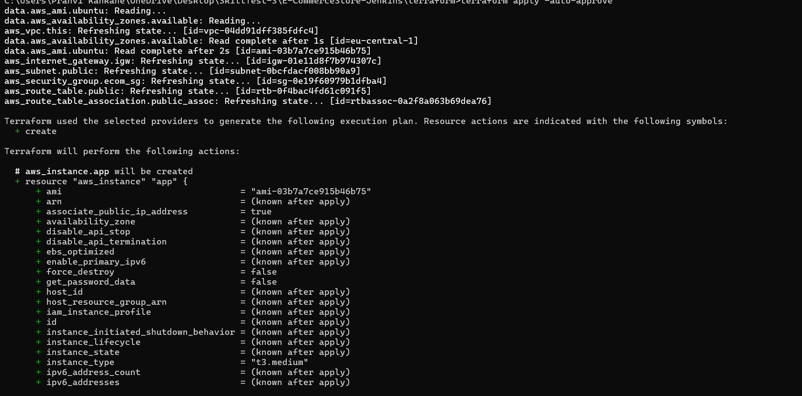

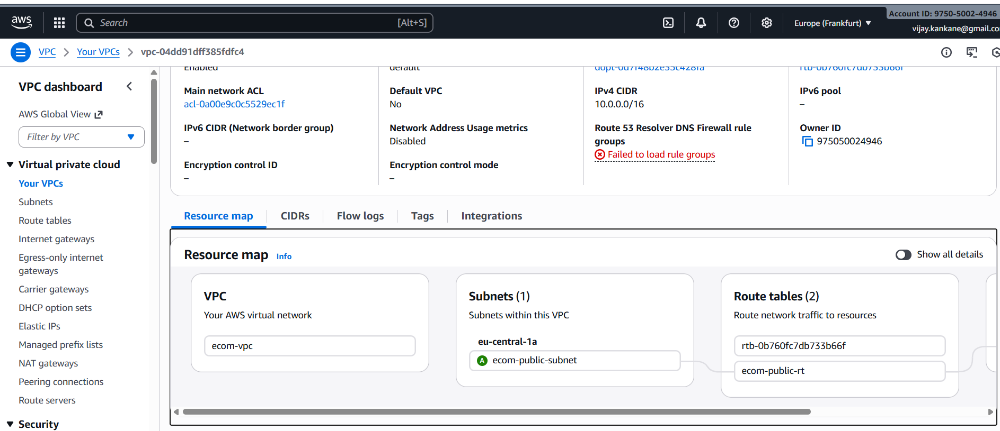

SG are created with the 3000 open for the frontend.
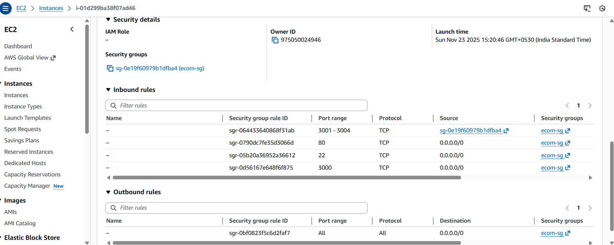

Docker installed on the machine and images are pulled automatically
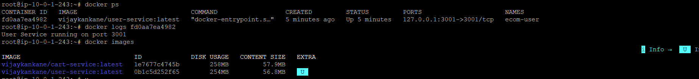

all images automatically pulled and running 
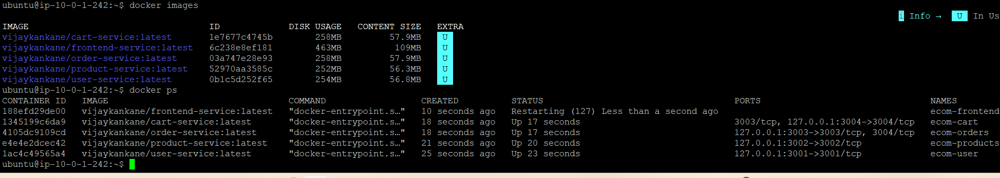

terraform destroy post testing the same

